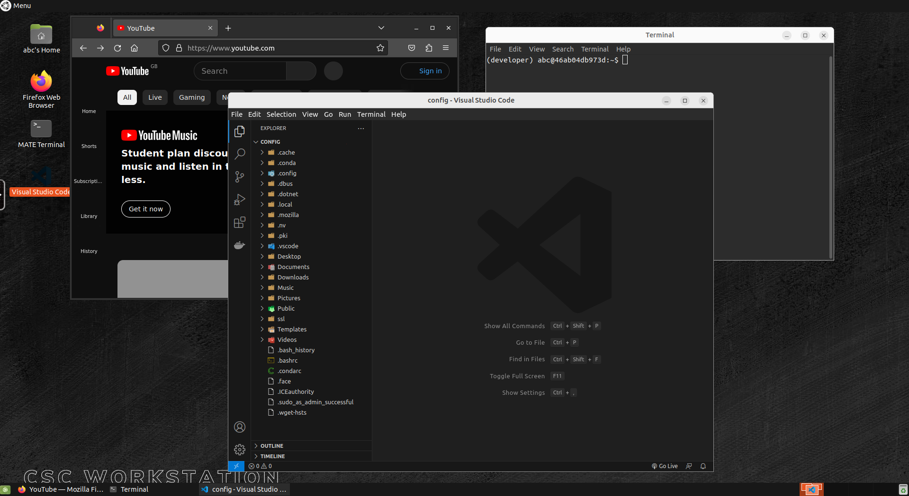

# CSC Workstaion

## Overview
CSC Workstation gives users a full Ubuntu-based workstation in their web browser. This standard workstation comes with [VS Code](https://code.visualstudio.com/), [miniconda](https://docs.conda.io/projects/miniconda/en/latest/) and [firefox](https://www.mozilla.org/en-GB/firefox/) installed for a strong foundational workspace for developers.

## Getting Started
1. Clone the CSC-Software-Stack GitHub repository 
```console
git clone https://github.com/SamPIngram/CSC-Software-Stack.git
```
2. Navigate to this application. Should be within the `applications` directory.
3. Make sure you have [docker-compose](https://docs.docker.com/compose/install/) installed.
```console
docker compose version
```
4. Launch the application, changing the included build-arguments as desired.
```console
docker compose up --build-arg INSTANCE_ID=TEST --build-arg HTTP_PORT=3000 --build-arg HTTPS_PORT=3001 --build-arg PASSWORD=abc --build-arg TITLE=csc_workstation
```

## Usage

On launch, the user will be presented with a login request. The standard user is `abc` and the password is set in the above `--build-arg PASSWORD=` command.

If you are setting up the workstation for a user or yourself there is a helpful setup bash script. This script adds shortcuts to apps on the desktop, installs several VS Code extensions and adds some SSL exceptions to downloading packages from standard code repositories. This has been done due to many clinical settings networks, which use network traffic surveillance, to appear as tampered with by external repositories which disables successful download of software packages. 

